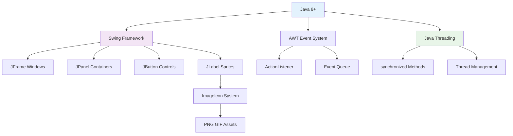

# 🎮 Documentação do Projeto Profemon

## 📖 Visão Geral
O **Profemon** é um jogo de RPG desenvolvido em Java que utiliza Swing para interface gráfica. O projeto implementa um sistema de combate entre personagens do tipo "Profemon" (baseados em professores) e inimigos, com mecânicas de evolução, experiência, sistema de níveis e animações de batalha.

O jogo possui uma narrativa onde o jogador é um "jovem universitário" que deve enfrentar os "inimigos do conhecimento" com a ajuda de seus Profemons.

## 🏗️ Estrutura do Projeto

### 📁 Arquivos Principais

- **`jogo.java`** - Classe principal do jogo com interface gráfica completa e sistema de seleção
- **`personagens.java`** - Classe abstrata base para todos os personagens
- **`profemon.java`** - Classe abstrata para personagens jogáveis com sistema de evolução
- **`inimigos.java`** - Classe abstrata para personagens inimigos com IA de movimento
- **`inimigoPadrão.java`** - Implementação concreta de um inimigo
- **`Paiola.java`** - Profemon baseado no professor Paiola (tipo Programador)
- **`Andrea.java`** - Profemon baseado na professora Andrea (tipo Programador)  
- **`LH.java`** - Profemon baseado no professor LH (tipo Matemático)
- **`Douglas.java`** - Profemon baseado no professor Douglas (tipo Programador)
- **`Emilia.java`** - Profemon baseado na professora Emilia (tipo Matemático)
- **`Matheus.java`** - Profemon baseado no professor Matheus (tipo Engenheiro)

### 🎨 Recursos Gráficos
- **`Sprints/`** - Diretório contendo sprites dos personagens e elementos visuais:
  - Sprites dos Profemons: Andrea, Douglas, Emilia, LH, Matheus, Paiola (Front, Back e PB)
  - Sprites de inimigos: Boss1, Boss2, CaisTharla, Cherrys, FluFlu
  - Animações de ataques: AttackBuff.gif, AttackLight.gif, AttackMid.gif, AttackUlt.gif
  - Ícones especiais: IconCaixaDeVetores.png, IconNotebook.png
- **`Backgrounds/`** - Diretório com cenários de fundo:
  - Biblioteca_BG.png, LEPEC_BG.png, Portaria_BG.png, PrimeiroDeMaio_BG.png, RU_BG.png

## 🏛️ Arquitetura do Sistema

### 📊 Hierarquia de Classes

```
personagens (abstract)
├── profemon (abstract)
│   ├── Paiola (concrete) - Tipo: Programador
│   ├── Andrea (concrete) - Tipo: Programador
│   ├── LH (concrete) - Tipo: Matemático
│   ├── Douglas (concrete) - Tipo: Programador
│   ├── Emilia (concrete) - Tipo: Matemático
│   └── Matheus (concrete) - Tipo: Engenheiro
└── inimigos (abstract)
    └── inimigoPadrão (concrete)
```

### 🏗️ Classe Base: `personagens`

A classe abstrata `personagens` define a estrutura básica para todos os personagens do jogo:

**Atributos:**
- `nome`, `tipo` - Identificação do personagem
- `vida`, `ataque`, `defesa` - Atributos de combate
- `posicaoX`, `posicaoY` - Posição no campo de batalha
- `velocidade` - Velocidade de movimento/animação
- `velocidadedosataques[]` - Array com velocidades dos 4 ataques
- `imagem`, `label` - Componentes gráficos (ImageIcon e JLabel)

**Métodos Principais:**
- `atacarnormal()` - Sistema de ataque com animação de projétil
- `receberDano()` (abstrato) - Processamento de dano recebido
- `derrotado()` (abstrato) - Ação quando o personagem é derrotado
- `esperar()` - Método auxiliar para pausas nas animações

### 🎓 Classe `profemon`

Estende `personagens` e representa os personagens controlados pelo jogador:

**Atributos Específicos:**
- `nivel` - Nível atual do Profemon (1-100)
- `experiencia` - Pontos de experiência acumulados
- `evolucao` - Estágio evolutivo atual
- `vidamaxima` - Vida máxima do personagem

**Funcionalidades:**
- **Sistema de Níveis:** Evolução através de experiência (88 XP por nível)
- **Sistema de Evolução:** 
  - Evoluções especiais nos níveis 16 e 40 (dobrando atributos)
  - Nível máximo: 100
  - Aumento gradual de atributos por nível
- **Interface de Características:** Janela dedicada para visualizar status
- **Sistema de Revival:** Capacidade de ser revivido com vida restaurada
- **4 Ataques Diferentes:** Cada Profemon possui 4 ataques abstratos implementáveis

**Métodos Destacados:**
- `mostrarCaracteristicas()` - Exibe janela com foto e informações detalhadas
- `evoluirdenivel()` - Gerencia evolução por nível com aumentos de atributos
- `evoluiProf()` - Evolução especial com multiplicadores significativos
- `EliminouInimigo()` - Ganha experiência ao derrotar inimigos
- `receberDano()` - Calcula dano considerando defesa do personagem
- `reviveu()` - Sistema de ressurreição com restauração de vida

### 🐍 Classe `inimigos`

Estende `personagens` e representa os adversários:

**Características:**
- **Sistema de Movimento:** Movimentação automática através do método `andar()`
- **IA Básica:** Movimento contínuo enquanto vivo
- **Threading:** Execução paralela com interruption handling
- **Recompensa Dinâmica:** Experiência baseada em `20*defesa+dano/100`

**Métodos Específicos:**
- `andar()` - Loop de movimento com controle de velocidade
- `receberDano()` - Processa dano e recompensa o atacante
- `derrotado()` - Interrompe threads e exibe animação de derrota

### 🎯 Profemons Implementados

#### 👨‍💻 Paiola
- **Tipo:** Programador
- **Atributos Iniciais:** Vida: 100, Ataque: 20, Defesa: 20, Nível: 1
- **Velocidades de Ataque:** [10, 15, 20, 25]

#### 👩‍💻 Andrea  
- **Tipo:** Programador
- **Atributos Iniciais:** Vida: 100, Ataque: 20, Defesa: 20, Nível: 1
- **Velocidades de Ataque:** [10, 15, 20, 25]

#### 🧮 LH (Luiz Henrique)
- **Tipo:** Matemático
- **Atributos Iniciais:** Vida: 100, Ataque: 20, Defesa: 20, Nível: 1
- **Velocidades de Ataque:** [10, 15, 20, 25]

#### 👨‍💻 Douglas
- **Tipo:** Programador
- **Atributos Iniciais:** Vida: 80, Ataque: 115, Defesa: 75, Nível: 1
- **Velocidades de Ataque:** [85, 60, 70, 45]
- **Características:** Alto ataque, defesa moderada

#### 👩‍🔬 Emilia
- **Tipo:** Matemático
- **Atributos Iniciais:** Vida: 130, Ataque: 60, Defesa: 115, Nível: 1
- **Velocidades de Ataque:** [80, 50, 65, 40]
- **Características:** Alta vida e defesa, focado em resistência

#### 👨‍🔧 Matheus
- **Tipo:** Engenheiro
- **Atributos Iniciais:** Vida: 110, Ataque: 70, Defesa: 95, Nível: 1
- **Velocidades de Ataque:** [75, 55, 60, 30]
- **Características:** Estatísticas balanceadas, versatilidade

### 🏴‍☠️ Implementação Concreta: `inimigoPadrão`

Primeira implementação concreta de um inimigo com:
- **Nome:** Padrão
- **Tipo:** EntraçonoRU
- **Vida:** 13
- **Ataque:** 13  
- **Defesa:** 13
- **Velocidade:** 13
- **Sprite:** "Padrão.png"
- **Velocidades de Ataque:** [10, 15, 20, 25]

## ⚡ Funcionalidades Implementadas

### 🎮 Interface do Jogo
- **Tela Inicial:** Botão de início com layout centralizado
- **Sistema de Seleção:** Interface gráfica para escolha do Profemon inicial
- **Narrativa Introdutória:** Sequência de textos explicativos sobre o jogo
- **Layout Responsivo:** Uso de BorderLayout e GridLayout para organização

### ⚔️ Sistema de Combate
- **Animações de Ataque:** Movimento de projéteis com velocidades configuráveis
- **Cálculo de Dano:** Fórmula `dano/defesa` para balanceamento
- **Estados Visuais:** Mudança de sprites para personagens derrotados
- **Sincronização:** Métodos `synchronized` para thread safety

### 📈 Sistema de Progressão
- **Experiência:** 88 pontos necessários para evolução
- **Evolução Gradual:** +5 ataque, +5 defesa, +10 vida por nível
- **Evoluções Especiais:** 
  - Nível 16: Dobra ataque e defesa, quintuplica vida
  - Nível 40: Segunda evolução especial
  - Nível 100: Nível máximo atingido
- **Sprites Evolutivos:** Carregamento automático de `nome + nivel + .png`

### 🖼️ Interface Gráfica
- **Sprites Escalados:** Redimensionamento automático para 550x550 pixels
- **Janelas Modais:** Sistema de características com `JFrame` dedicado
- **Mensagens Informativas:** `JOptionPane` para feedback ao jogador
- **Threading Visual:** Animações não bloqueantes com `Thread.sleep()`

### 🧠 Sistema de IA
- **Movimento Autônomo:** Inimigos se movem independentemente
- **Controle de Velocidade:** Configuração individual de velocidade de movimento
- **Interrupção de Threads:** Gerenciamento seguro de threads ao morrer

## 🧵 Threading e Concorrência
O projeto utiliza extensivamente threading para:
- **Implementação de `Runnable`:** Tanto `profemon` quanto `inimigos` implementam a interface
- **Animações Paralelas:** Movimentos e ataques executados sem bloquear a UI
- **Movimentação de Inimigos:** Loop contínuo com controle de velocidade
- **Sincronização:** Métodos `synchronized` para evitar race conditions
- **Interrupção Segura:** Tratamento adequado de `InterruptedException`

## 🎮 Tipos de Profemon

O jogo agora conta com **três tipos distintos** de Profemon, cada um com características únicas:

### 👨‍💻 Tipo Programador
- **Representantes:** Paiola, Andrea, Douglas
- **Características:** Equilibrio entre ataque e velocidade
- **Estratégia:** Versáteis em combate, bons para iniciantes

### 🧮 Tipo Matemático  
- **Representantes:** LH, Emilia
- **Características:** Alta defesa e vida, foco em resistência
- **Estratégia:** Tanques ideais para absorver dano

### 👨‍🔧 Tipo Engenheiro
- **Representantes:** Matheus
- **Características:** Atributos balanceados, versatilidade tática
- **Estratégia:** Adaptável a diferentes situações de combate

## 🏆 Sistema de Fases

O jogo implementa um sistema progressivo de fases:
- **Fase 1-4:** Enfrentamento contra diferentes tipos de inimigos
- **Sistema de Equipes:** Suporte para até 6 Profemons e 6 inimigos simultâneos
- **Progressão:** Desbloqueio gradual de conteúdo

## 🏗️ Arquitetura Técnica Avançada

### 📊 Hierarquia de Classes UML
```mermaid
classDiagram
    class personagens {
        <<abstract>>
        +String nome, tipo
        +int vida, ataque, defesa
        +int[] velocidadedosataques
        +ImageIcon imagemFrente
        +receberDano()
        +derrotado() abstract
    }
    
    class profemon {
        <<abstract>>
        +int nivel, experiencia, evolucao
        +synchronized receberDano()
        +mostrarCaracteristicas()
        +evoluirdenivel()
    }
    
    class inimigos {
        <<abstract>>
        +synchronized receberDano()
        +derrotado()
    }
    
    personagens <|-- profemon
    personagens <|-- inimigos
    profemon <|-- Paiola
    profemon <|-- Andrea
    profemon <|-- LH
    profemon <|-- Douglas
    profemon <|-- Emilia
    profemon <|-- Matheus
    inimigos <|-- inimigoPadrão
```

### 🧵 Sistema de Threading e Concorrência

**Principais Características:**
- **Métodos Synchronized:** Controle de acesso concorrente em `receberDano()`
- **Thread Separation:** UI não trava durante animações e batalhas
- **Lambda Expressions:** Execução assíncrona de fases usando `new Thread(() -> {...}).start()`
- **Event Dispatch Thread:** Gerenciamento seguro de eventos Swing

**Exemplo de Implementação:**
```java
// Thread safety em combate
public synchronized void receberDano(int dano, inimigos Autor) {
    this.vida -= dano/this.defesa;
    if (this.vida <= 0) {
        derrotado();
    }
}

// Execução assíncrona de fases
new Thread(() -> {
    confronto = batalha(equipe, equipeinimigos, Biblioteca);
    if(confronto) venceuafase1 = true;
}).start();
```

### 🎯 Padrões de Design Implementados

| Padrão | Implementação | Benefício |
|--------|---------------|-----------|
| **Template Method** | Classes abstratas `personagens` | Evita duplicação de código |
| **Strategy Pattern** | Diferentes ataques por Profemon | Flexibilidade de comportamento |
| **Observer Pattern** | Sistema `ActionListener` | Desacoplamento UI/Lógica |
| **Factory (Implícito)** | Criação de personagens | Polimorfismo e extensibilidade |

### ⚡ Stack Tecnológica



### 🔧 Especificações de Performance

- **Threading Model:** Event Dispatch Thread + Background Worker Threads
- **Memory Management:** Sprite caching para otimização
- **Synchronization:** Apenas em métodos críticos de combate
- **UI Responsiveness:** Animações não-bloqueantes com `Thread.sleep()`

---
## 📊 Estado Atual do Projeto

### ✅ Funcionalidades Completas
- Estrutura completa de classes com herança bem definida
- Sistema de combate totalmente funcional com 4 ataques por personagem
- Mecânicas de evolução e progressão implementadas
- Interface gráfica principal com seleção de personagem
- Sistema de threading para animações e movimento
- **Seis Profemons jogáveis** totalmente implementados (Paiola, Andrea, LH, Douglas, Emilia, Matheus)
- Sistema de experiência e níveis funcionando
- Sistema de sprites evolutivos com Front/Back/PB (Preto e Branco)
- Múltiplos cenários de fundo implementados
- Animações de ataques com GIFs
- Sistema de fases progressivas no jogo principal

### 🚧 Em Desenvolvimento
- Sistema de batalha em tempo real completamente integrado
- Implementação de mais variedades de inimigos (Fluflu, Boss1, Boss2, etc.)
- Sistema completo de mapas e cenários com os backgrounds disponíveis
- Sistema de itens e poder-ups
- Balanceamento avançado entre os diferentes tipos de Profemon

### ❌ Pendências
- Completar a lógica de batalha avançada na classe `jogo`
- Implementar classes para inimigos Fluflu, Boss1, Boss2, CaisTharla, Cherrys
- Integrar os cenários de fundo (Backgrounds/) no gameplay
- Sistema de save/load de progresso
- Implementar sistema de tipos com vantagens/desvantagens
- Adicionar trilha sonora e efeitos sonoros

## 🚀 Próximos Passos Sugeridos

### 🎯 Prioridade Alta
1. **Implementar Classes de Inimigos Faltantes:** Criar Fluflu, Boss1, Boss2, CaisTharla, Cherrys
2. **Integração de Cenários:** Utilizar os backgrounds disponíveis no sistema de mapas
3. **Sistema de Tipos:** Implementar vantagens/desvantagens entre Programador, Matemático e Engenheiro
4. **Balanceamento:** Ajustar atributos dos Profemons para gameplay equilibrado

### 🎯 Prioridade Média  
5. **Sistema de Narrativa:** Expandir a história com os cenários disponíveis
6. **Sistema de Inventário:** Itens, poções e equipamentos
7. **Animações Avançadas:** Utilizar os GIFs de ataque disponíveis
8. **Sistema de Save/Load:** Persistência de progresso do jogador

### 🎯 Melhorias Futuras
9. **Multiplayer Local:** Batalhas entre jogadores
10. **Sistema de Achievements:** Conquistas e objetivos
11. **Trilha Sonora:** Efeitos sonoros e música de fundo
12. **Animações Avançadas:** Sprites animados e efeitos visuais

## 🛠️ Tecnologias Utilizadas

- **☕ Java 8+** - Linguagem de programação principal
- **🖼️ Swing** - Framework para interface gráfica nativa
- **🧵 Threading** - Para animações e processamento paralelo  
- **📷 ImageIcon** - Para carregamento e manipulação de sprites
- **🎨 AWT** - Para componentes gráficos e layout managers
- **⚡ Event Handling** - Sistema de eventos com ActionListener

## 📋 Dependências
- **JDK 8+** (recomendado JDK 11 ou superior)
- **Swing** (incluído no JDK)
- **AWT** (incluído no JDK)

## ▶️ Como Executar

### 📦 Pré-requisitos
```bash
# Verificar versão do Java
java -version
javac -version
```

### 🏃‍♂️ Passos para Execução
```bash
# 1. Navegar para o diretório do projeto
cd /caminho/para/Profemon

# 2. Compilar todos os arquivos Java
javac *.java

# 3. Executar o jogo
java jogo
```

### ⚠️ Requisitos Importantes
- Certifique-se de que o diretório `Sprints/` esteja no mesmo nível dos arquivos `.java`
- Todas as imagens devem estar no formato correto (PNG/JPEG)
- Resolução recomendada: 1920x1080 ou superior

## 📁 Estrutura de Diretórios
```
Profemon/
├── 📄 jogo.java              # Classe principal com interface gráfica
├── 📄 personagens.java       # Classe abstrata base
├── 📄 profemon.java         # Classe abstrata para jogadores
├── 📄 inimigos.java         # Classe abstrata para adversários
├── 📄 inimigoPadrão.java   # Inimigo concreto implementado
├── 📄 Paiola.java           # Profemon do Professor Paiola
├── 📄 Andrea.java           # Profemon da Professora Andrea
├── 📄 LH.java               # Profemon do Professor LH
├── 📄 Douglas.java          # Profemon do Professor Douglas
├── 📄 Emilia.java           # Profemon da Professora Emilia
├── 📄 Matheus.java          # Profemon do Professor Matheus
├── 📄 README.md             # Esta documentação
├── 📁 Sprints/              # Diretório de sprites e animações
│   ├── 🖼️ Andrea1Front.png, Andrea1Back.png, Andrea1BackPB.png
│   ├── 🖼️ Douglas1Front.png, Douglas1Back.png, Douglas1BackPB.png
│   ├── 🖼️ Emilia1Front.png, Emilia1Back.png, Emilia1BackPB.png
│   ├── 🖼️ Lh1Front.png, Lh1Back.png, Lh1BackPB.png
│   ├── 🖼️ Matheus1Front.png, Matheus1Back.png, Matheus1BackPB.png
│   ├── 🖼️ Paiola1Front.png, Paiola1Back.png, Paiola1BackPB.png
│   ├── 🖼️ Boss1.png, Boss1PB.png, Boss2.png, Boss2PB.png
│   ├── 🖼️ FluFlu.png, FluFluPB.png, CaisTharla.png, CaisTharlaPB.png
│   ├── 🖼️ Cherrys.png, CherrysPB.png
│   ├── 🎬 AttackBuff.gif, AttackLight.gif, AttackMid.gif, AttackUlt.gif
│   └── 🎯 IconCaixaDeVetores.png, IconNotebook.png
└── 📁 Backgrounds/          # Diretório de cenários
    ├── 🏛️ Biblioteca_BG.png
    ├── 🏢 LEPEC_BG.png
    ├── � Portaria_BG.png
    ├── 🏭 PrimeiroDeMaio_BG.png
    └── 🍽️ RU_BG.png
```

## 🎯 Características do Design

### 🏗️ Padrões de Design Utilizados
- **Template Method:** Classes abstratas definem algoritmos base
- **Strategy Pattern:** Diferentes implementações de Profemon
- **Observer Pattern:** Sistema de eventos com ActionListener
- **Runnable Interface:** Para threading e concorrência

### 📐 Princípios SOLID Aplicados
- **Single Responsibility:** Cada classe tem uma responsabilidade específica
- **Open/Closed:** Extensível via herança, fechado para modificação
- **Interface Segregation:** Interfaces específicas como Runnable e ActionListener

## 🐛 Troubleshooting

### ❌ Problemas Comuns

**1. Erro de "Cannot find symbol"**
```bash
# Solução: Compilar todos os arquivos juntos
javac *.java
```

**2. Imagens não aparecem**
```bash
# Verificar se as imagens estão no diretório correto
ls Sprints/
# Verificar nomes dos arquivos (case-sensitive)
```

**3. Exception em Threading**
```java
// Verificar se há InterruptedException sendo tratada
catch (InterruptedException e) {
    Thread.currentThread().interrupt();
}
```

## 📚 Documentação Adicional

### 🔧 Para Desenvolvedores
- Todas as classes abstratas devem ter implementações concretas
- Sprites devem seguir convenção: `nome + nivel + .png`
- Threading deve sempre tratar InterruptedException
- Métodos synchronized são necessários para combate seguro entre threads

### 🎮 Para Jogadores
- Use as características dos Profemons para escolher estratégias
- Evolua seus Profemons para aumentar poder de combate
- Diferentes tipos podem ter vantagens específicas

---

**📅 Última Atualização:** Julho 2025  
**👥 Desenvolvido por:** Equipe de Desenvolvimento Profemon  
**📧 Contato:** Para dúvidas sobre o projeto, consulte a documentação no código

## 📊 Estatísticas do Projeto

- **Total de Classes:** 11 arquivos Java
- **Profemons Disponíveis:** 6 (Paiola, Andrea, LH, Douglas, Emilia, Matheus)
- **Tipos de Profemon:** 3 (Programador, Matemático, Engenheiro)
- **Sprites Implementados:** 33+ arquivos de imagem
- **Cenários Disponíveis:** 5 backgrounds temáticos
- **Animações:** 4 GIFs de ataques especiais
- **Sistema de Fases:** 4 fases progressivas implementadas
