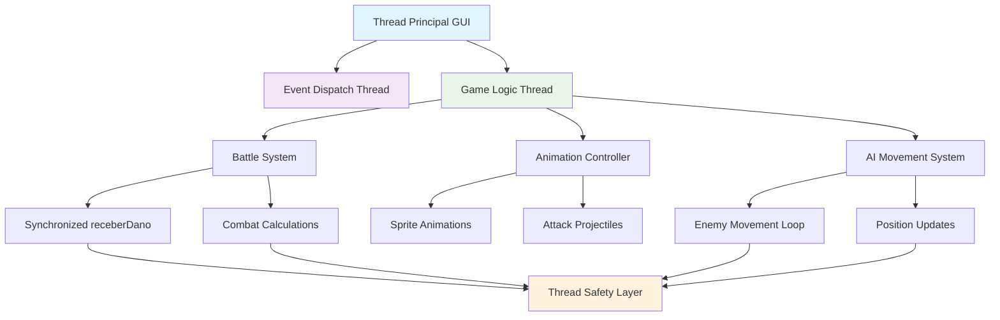
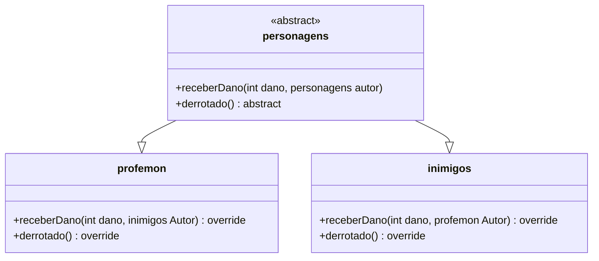
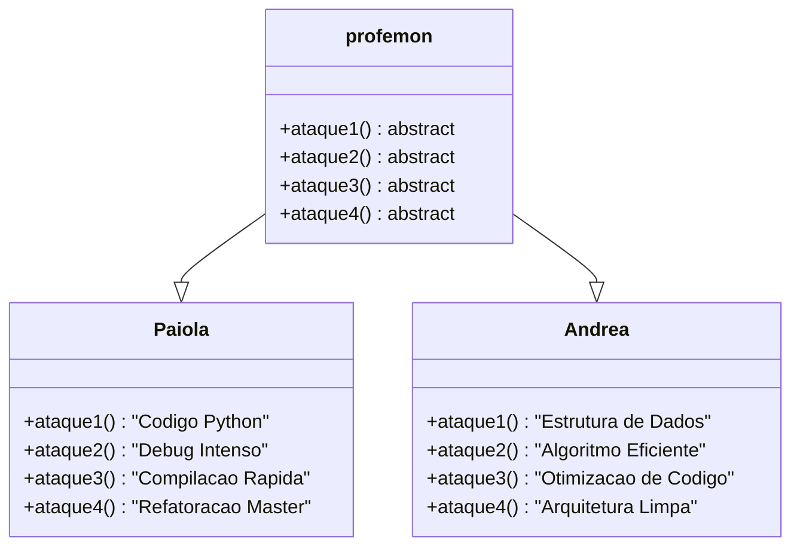
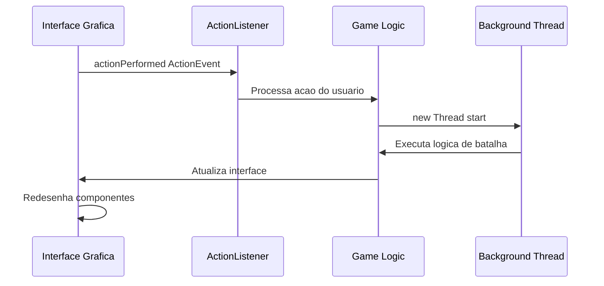
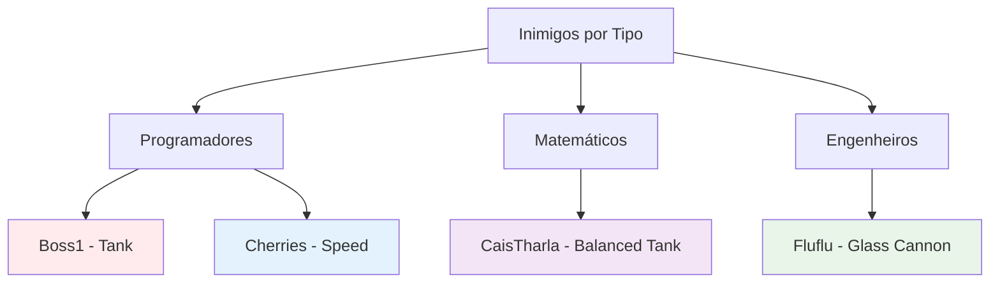
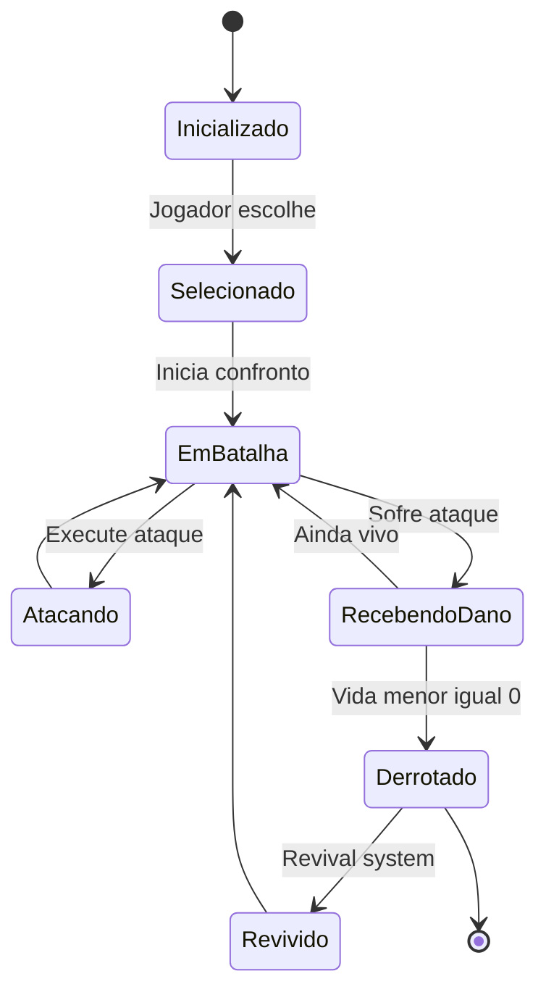
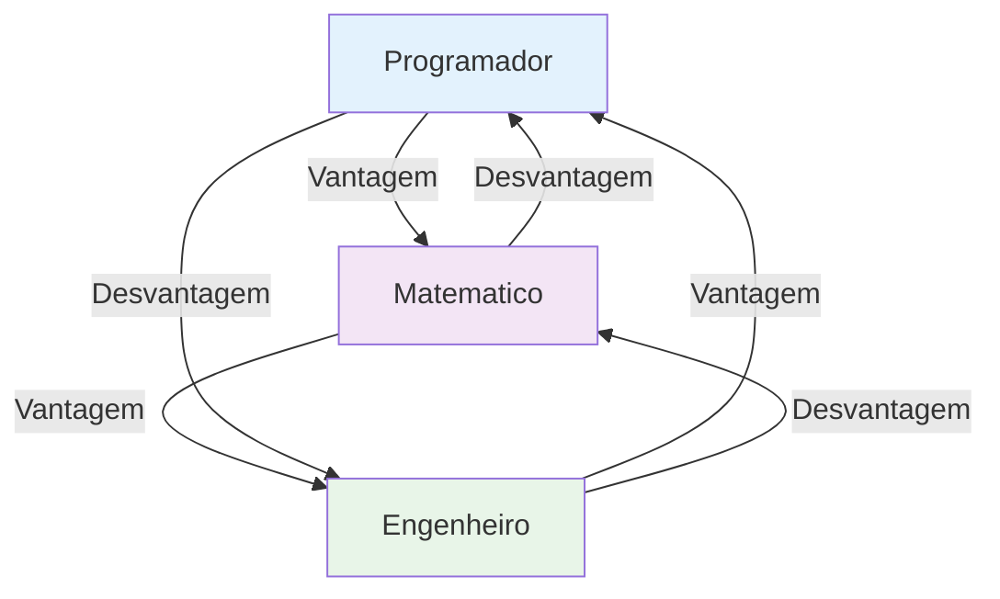
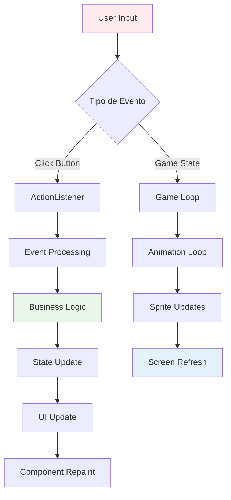

# 🏗️ Relatório Técnico: Arquitetura e Tecnologias do Projeto Profemon

## 📊 Arquitetura Geral do Sistema

### 🎯 Visão Arquitetural
O Profemon implementa uma arquitetura orientada a objetos robusta baseada em **padrões de design consolidados** e **princípios SOLID**. A estrutura utiliza herança múltipla, polimorfismo e encapsulamento para criar um sistema escalável e maintível.

### 📐 Hierarquia de Classes (Diagrama UML)

```mermaid
classDiagram
    class personagens {
        <<abstract>>
        +String nome
        +String tipo
        +int vida
        +int ataque
        +int defesa
        +int[] velocidadedosataques
        +int[] poderdosataques
        +ImageIcon imagemFrente
        +ImageIcon imagemderrotado
        +JLabel label
        +receberDano(int dano, personagens autor)
        +derrotado() abstract
    }
    
    class profemon {
        <<abstract>>
        +int nivel
        +int experiencia
        +int evolucao
        +int vidamaxima
        +ImageIcon imagemcostas
        +mostrarCaracteristicas()
        +synchronized receberDano(int dano, inimigos Autor)
        +derrotado()
        +evoluirdenivel()
        +evoluiProf()
        +EliminouInimigo(int exp)
        +reviveu(int vidaRestaurada)
    }
    
    class inimigos {
        <<abstract>>
        +synchronized receberDano(int dano, profemon Autor)
        +derrotado()
    }
    
    class jogo {
        +boolean comecou
        +boolean escolha
        +boolean confronto
        +profemon[] equipe
        +inimigos[] equipeinimigos
        +volatile int indice
        +actionPerformed(ActionEvent e)
        +batalha(profemon[] equipe, inimigos[] inimigos, ImageIcon fundo)
        +telaescolherprofemon(profemon... profs)
        +esperar(int tempo)
    }
    
    class Paiola {
        +Paiola()
        +ataque1()
        +ataque2()
        +ataque3()
        +ataque4()
    }
    
    class Andrea {
        +Andrea()
        +ataque1()
        +ataque2()
        +ataque3()
        +ataque4()
    }
    
    class LH {
        +LH()
        +ataque1()
        +ataque2()
        +ataque3()
        +ataque4()
    }
    
    class Douglas {
        +Douglas()
        +ataque1()
        +ataque2()
        +ataque3()
        +ataque4()
    }
    
    class Emilia {
        +Emilia()
        +ataque1()
        +ataque2()
        +ataque3()
        +ataque4()
    }
    
    class Matheus {
        +Matheus()
        +ataque1()
        +ataque2()
        +ataque3()
        +ataque4()
    }
    
    class inimigoPadrão {
        +inimigoPadrão()
    }
    
    class Boss1 {
        +Boss1()
    }
    
    class Boss2 {
        +Boss2()
    }
    
    class Fluflu {
        +Fluflu()
    }
    
    class CaisTharla {
        +CaisTharla()
    }
    
    class Cherries {
        +Cherries()
    }
    
    personagens --|> profemon
    personagens --|> inimigos
    profemon --|> Paiola
    profemon --|> Andrea
    profemon --|> LH
    profemon --|> Douglas
    profemon --|> Emilia
    profemon --|> Matheus
    inimigos --|> Boss1
    inimigos --|> Boss2
    inimigos --|> Fluflu
    inimigos --|> CaisTharla
    inimigos --|> Cherries
    jogo --> profemon : manages
    jogo --> inimigos : manages
    jogo ..|> ActionListener : implements
```

## 🧵 Arquitetura de Threading e Concorrência

### 🔄 Modelo de Concorrência



### 🔐 Controle de Concorrência

#### **Métodos Synchronized**
```java
// Classe profemon
public synchronized void receberDano(int dano, inimigos Autor) {
    this.vida -= dano/this.defesa;
    if (this.vida <= 0) {
        derrotado();
    }
}

// Classe inimigos
public synchronized void receberDano(int dano, profemon Autor) {
    this.vida -= dano/this.defesa;
    if (this.vida <= 0) {
        derrotado();
        Autor.EliminouInimigo(20*defesa+dano/100);
    }
}
```

#### **Thread Management com Lambda Expressions**
```java
// Execução assíncrona de fases
new Thread(() -> {
    equipeinimigos[0] = new Fluflu();
    quantiadedeinimigos = 1;
    confronto = batalha(equipe, equipeinimigos, Biblioteca);
    if(confronto) venceuafase1 = true;
}).start();
```

## 🏗️ Padrões de Design Implementados

### 📋 Template Method Pattern


### 🎮 Strategy Pattern para Ataques


### 🔔 Observer Pattern para Eventos


## 🐲 Sistema de Inimigos Implementados

### 📊 Diversidade de Adversários

O projeto agora conta com **cinco tipos diferentes de inimigos**, cada um implementando estratégias e estatísticas únicas:

#### 🤖 Boss1 - "Paradoxo Compilado"
```java
public class Boss1 extends inimigos {
    // Estatísticas: Tank defensivo
    vida = 200, ataque = 80, defesa = 170
    // Perfil: Boss principal com foco em resistência
}
```

#### 👾 Boss2 
```java
public class Boss2 extends inimigos {
    // Boss secundário com características intermediárias
}
```

#### 🐾 Fluflu
```java
public class Fluflu extends inimigos {
    // Estatísticas: Atacante ágil
    vida = 68, ataque = 95, defesa = 60
    tipo = "Engenheiro"
    // Perfil: High damage, low defense
}
```

#### 🧮 CaisTharla
```java
public class CaisTharla extends inimigos {
    // Estatísticas: Tank matemático
    vida = 140, ataque = 50, defesa = 100
    tipo = "Matemático"
    // Perfil: Resistente com foco defensivo
}
```

#### 🍒 Cherries (Cherrys)
```java
public class Cherries extends inimigos {
    // Estatísticas: Velocista
    vida = 65, ataque = 95, defesa = 60
    tipo = "Programador"
    velocidadedosataques = [95, 85, 0, 0]
    // Perfil: Ataques extremamente rápidos
}
```

### 📈 Análise Estatística dos Inimigos

| Inimigo | Tipo | Vida | Ataque | Defesa | Estratégia |
|---------|------|------|--------|--------|------------|
| **Boss1** | Programador | 200 | 80 | 170 | Tank defensivo |
| **Fluflu** | Engenheiro | 68 | 95 | 60 | DPS ágil |
| **CaisTharla** | Matemático | 140 | 50 | 100 | Tank equilibrado |
| **Cherries** | Programador | 65 | 95 | 60 | Speedster |
| **Boss2** | - | - | - | - | Boss intermediário |

### 🎯 Sistema de Balanceamento



## 🔧 Especificações Técnicas Detalhadas

### 🏭 Sistema de Factory Pattern (Implícito)
```java
// Criação dinâmica de Profemons
profemon[] equipe = new profemon[6];
equipe[0] = new Paiola();    // Factory method implicito
equipe[1] = new Andrea();    // Diferentes implementacoes
equipe[2] = new LH();        // Polimorfismo em acao
```

### 🔄 Lifecycle Management


### 🎯 Sistema de Tipos e Balanceamento

#### **Matriz de Efetividade (Proposta)**


### 🧮 Fórmulas de Combate

#### **Cálculo de Dano**
```
Dano Final = Dano Base / Defesa do Alvo
```

#### **Sistema de Experiência**
```
XP Ganho = 20 * Defesa do Inimigo + (Dano Causado / 100)
XP para Próximo Nível = 88 pontos
```

#### **Evolução de Atributos**
```
Por Nível: +5 Ataque, +5 Defesa, +10 Vida
Nível 16: Ataque x2, Defesa x2, Vida x5
Nível 40: Segunda evolução especial
Nível 100: Máximo absoluto
```

### 🎮 Arquitetura de Input/Output



---

## 📊 Status Atual do Projeto (Julho 2025)

### ✅ Conquistas Recentes
- **Expansão de Inimigos:** Implementação completa de 5 tipos de inimigos diferentes
- **Diversidade de Tipos:** Todos os 3 tipos (Programador, Matemático, Engenheiro) representados nos inimigos
- **Balanceamento Estatístico:** Diferentes perfis de combate (Tank, DPS, Speed, Balanced)
- **Arquitetura Sólida:** Herança bem estruturada permitindo expansão fácil

### 🎯 Impacto Técnico
- **Escalabilidade Comprovada:** A arquitetura permitiu adicionar 5 inimigos sem quebrar o código existente
- **Polimorfismo Efetivo:** Sistema de herança funcionando perfeitamente para novos personagens
- **Manutenibilidade:** Código limpo e bem documentado facilitando futuras expansões

### 🔮 Próximas Evoluções Técnicas
1. **Sistema de IA Avançada:** Implementar diferentes estratégias de combate por tipo
2. **Design Patterns Adicionais:** Considerar Command Pattern para ataques e State Pattern para fases
3. **Performance Optimization:** Cache de sprites e otimização de threading
4. **Arquitetura de Plugins:** Permitir adição de novos conteúdos sem recompilação

**Esta arquitetura robusta e expansível confirma a solidez dos princípios de design aplicados, demonstrando a capacidade do sistema de crescer organicamente mantendo a qualidade do código.**

---

**📅 Relatório Atualizado:** Julho 2025  
**🔧 Versão da Arquitetura:** 2.0 - Expansão de Inimigos  
**📈 Complexidade do Sistema:** Média-Alta, bem gerenciada através de padrões de design  
**🎮 Status de Desenvolvimento:** Fase de Expansão de Conteúdo
