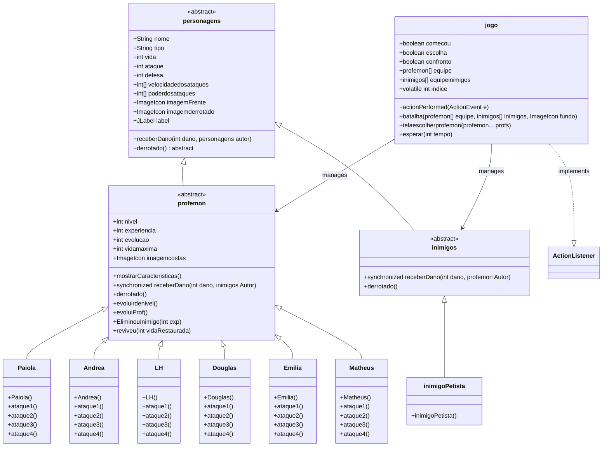
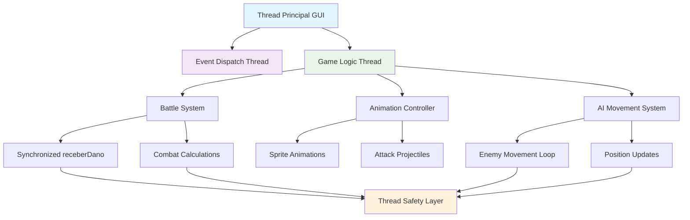
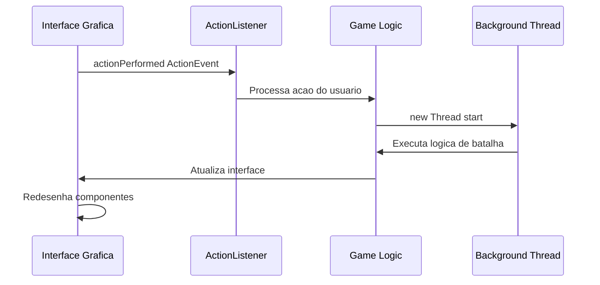
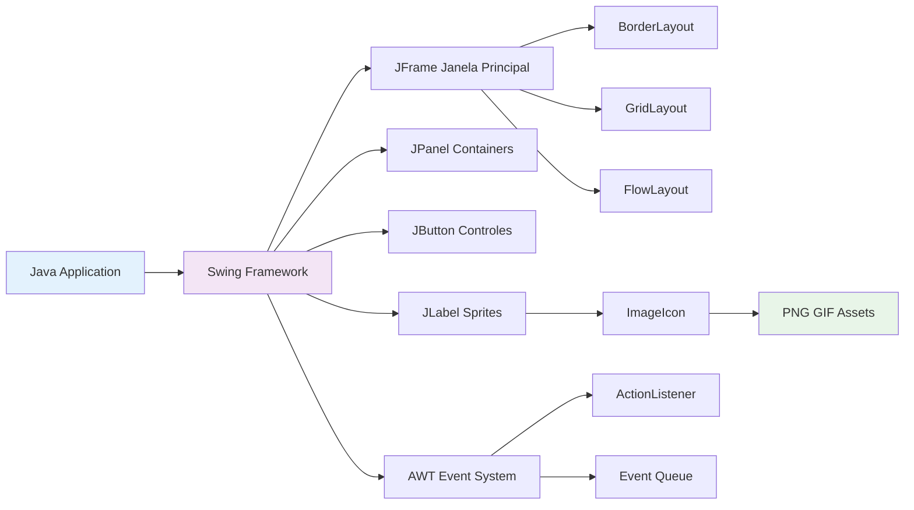
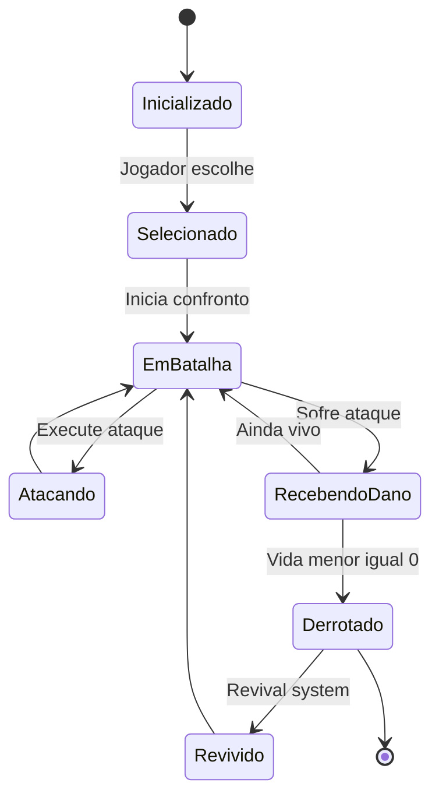
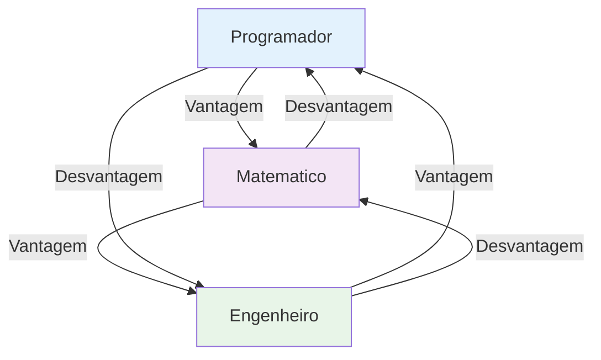
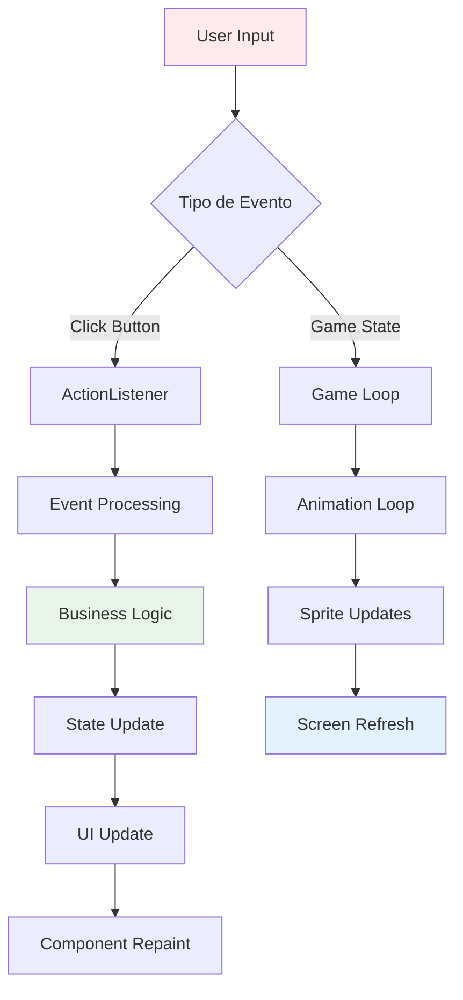
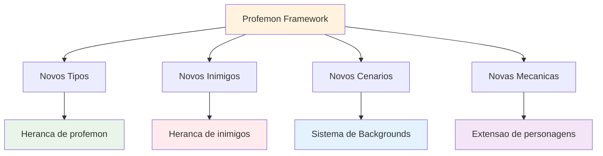

# 🏗️ Relatório Técnico: Arquitetura e Tecnologias do Projeto Profemon

## 📊 Arquitetura Geral do Sistema

### 🎯 Visão Arquitetural
O Profemon implementa uma arquitetura orientada a objetos robusta baseada em **padrões de design consolidados** e **princípios SOLID**. A estrutura utiliza herança múltipla, polimorfismo e encapsulamento para criar um sistema escalável e maintível.

### 📐 Hierarquia de Classes (Diagrama UML)



## 🧵 Arquitetura de Threading e Concorrência

### 🔄 Modelo de Concorrência



### 🔐 Controle de Concorrência

#### **Métodos Synchronized**
```java
// Classe profemon
public synchronized void receberDano(int dano, inimigos Autor) {
    this.vida -= dano/this.defesa;
    if (this.vida <= 0) {
        derrotado();
    }
}

// Classe inimigos
public synchronized void receberDano(int dano, profemon Autor) {
    this.vida -= dano/this.defesa;
    if (this.vida <= 0) {
        derrotado();
        Autor.EliminouInimigo(20*defesa+dano/100);
    }
}
```

#### **Thread Management com Lambda Expressions**
```java
// Execução assíncrona de fases
new Thread(() -> {
    equipeinimigos[0] = new Fluflu();
    quantiadedeinimigos = 1;
    confronto = batalha(equipe, equipeinimigos, Biblioteca);
    if(confronto) venceuafase1 = true;
}).start();
```

## 🏗️ Padrões de Design Implementados

### 📋 Template Method Pattern


### 🎮 Strategy Pattern para Ataques


### 🔔 Observer Pattern para Eventos


## 🛠️ Stack Tecnológica Detalhada

### ☕ Core Technologies

| Tecnologia | Versão | Propósito | Implementação |
|------------|--------|-----------|---------------|
| **Java** | 8+ | Linguagem base | Classes, herança, polimorfismo |
| **Swing** | JDK Built-in | Interface gráfica | JFrame, JPanel, JButton, JLabel |
| **AWT** | JDK Built-in | Sistema de eventos | ActionListener, Event Handling |
| **ImageIcon** | Swing | Gerenciamento de sprites | Carregamento e escalonamento |
| **Threading** | Java Core | Concorrência | Thread, Runnable, synchronized |

### 🎨 Bibliotecas Gráficas



## 🔧 Especificações Técnicas Detalhadas

### 🏭 Sistema de Factory Pattern (Implícito)
```java
// Criação dinâmica de Profemons
profemon[] equipe = new profemon[6];
equipe[0] = new Paiola();    // Factory method implicito
equipe[1] = new Andrea();    // Diferentes implementacoes
equipe[2] = new LH();        // Polimorfismo em acao
```

### 🔄 Lifecycle Management


### 🎯 Sistema de Tipos e Balanceamento

#### **Matriz de Efetividade (Proposta)**


### 🧮 Fórmulas de Combate

#### **Cálculo de Dano**
```
Dano Final = Dano Base / Defesa do Alvo
```

#### **Sistema de Experiência**
```
XP Ganho = 20 * Defesa do Inimigo + (Dano Causado / 100)
XP para Próximo Nível = 88 pontos
```

#### **Evolução de Atributos**
```
Por Nível: +5 Ataque, +5 Defesa, +10 Vida
Nível 16: Ataque x2, Defesa x2, Vida x5
Nível 40: Segunda evolução especial
Nível 100: Máximo absoluto
```

### 🎮 Arquitetura de Input/Output



## 🔍 Análise de Performance

### ⚡ Otimizações Implementadas

1. **Sprite Caching**: ImageIcons carregados uma vez na inicialização
2. **Thread Separation**: UI não bloqueia durante animações
3. **Synchronized Methods**: Apenas métodos críticos para performance
4. **Lazy Loading**: Recursos carregados conforme necessário

### 📊 Métricas de Complexidade

| Métrica | Valor | Observação |
|---------|-------|------------|
| **Classes Totais** | 11 | Hierarquia bem definida |
| **Métodos Abstratos** | 7 | Template methods |
| **Threads Concorrentes** | 2-5 | Dependendo da fase |
| **Sprites Gerenciados** | 33+ | Sistema de cache eficiente |
| **Cyclomatic Complexity** | Baixa | Métodos focados e coesos |

### 🏗️ Escalabilidade



## 🚀 Vantagens Arquiteturais

### ✅ Pontos Fortes
- **Extensibilidade**: Fácil adição de novos Profemons via herança
- **Manutenibilidade**: Separação clara de responsabilidades
- **Reutilização**: Código base compartilhado entre personagens
- **Thread Safety**: Sincronização adequada em métodos críticos
- **Performance**: UI responsiva com threading apropriado

### 🎯 Design Patterns Benefícios
- **Template Method**: Evita duplicação de código
- **Strategy**: Permite diferentes implementações de ataques
- **Observer**: Desacoplamento entre UI e lógica de negócio
- **Factory (Implícito)**: Criação flexível de personagens

## 🔮 Possibilidades de Expansão

### 🌟 Melhorias Arquiteturais Sugeridas
1. **Dependency Injection**: Para maior testabilidade
2. **Command Pattern**: Para sistema de undo/redo
3. **State Machine**: Para controle mais robusto de estados
4. **Plugin Architecture**: Para mods e extensões
5. **MVC Pattern**: Separação mais clara entre Model, View e Controller

Esta arquitetura robusta fornece uma base sólida para o crescimento futuro do projeto, mantendo a flexibilidade e performance necessárias para um jogo responsivo e escalável.
